## Tech Stack

  
  
  
  

  

## GitHub Stats

  
  

  

## DAILY-STUDY

> 매일 **AI·DA**와 **Backend** 분야에서 핵심 개념을 하나씩 학습합니다.

<!-- DAILY_STUDY:START -->
### Study Dashboard

| 🔥 현재 스트릭 | 🏆 최장 스트릭 | 📅 완료한 학습일 | 🧠 완료한 질문 |
|---:|---:|---:|---:|
| **2일** | **2일** | **2일** | **4개** |

#### 최근 학습

| 날짜 | AI·DA | Backend |
|---|---|---|
| 2026-07-21 | [머신러닝 vs 전통적 프로그래밍](https://github.com/sebalnakji/DAILY-STUDY/blob/main/notes/2026/2026-07-21-ai-data-ml-vs-traditional-programming.md) | [Latency vs Throughput](https://github.com/sebalnakji/DAILY-STUDY/blob/main/notes/2026/2026-07-21-backend-latency-vs-throughput.md) |
| 2026-07-20 | [지도 학습(Supervised Learning)](https://github.com/sebalnakji/DAILY-STUDY/blob/main/notes/2026/2026-07-20-ai-data-supervised-learning.md) | [Performance vs Scalability](https://github.com/sebalnakji/DAILY-STUDY/blob/main/notes/2026/2026-07-20-backend-performance-vs-scalability.md) |
<!-- DAILY_STUDY:END -->
