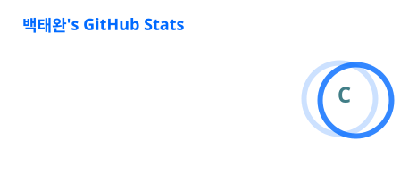
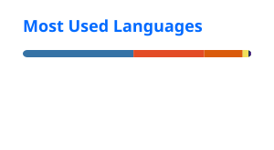

## Tech Stack

  
  
  
  

  

## GitHub Stats

  
  

  

## DAILY-STUDY

> 매일 **AI·DA**와 **Backend** 분야에서 핵심 개념을 하나씩 학습합니다.

<!-- DAILY_STUDY:START -->
### Study Dashboard

| 🔥 현재 스트릭 | 🏆 최장 스트릭 | 📅 완료한 학습일 | 🧠 완료한 질문 |
|---:|---:|---:|---:|
| **4일** | **6일** | **22일** | **44개** |

#### 최근 학습

| 날짜 | AI·DA | Backend |
|---|---|---|
| 2026-08-21 | [그래디언트 부스팅(Gradient Boosting)](https://github.com/sebalnakji/DAILY-STUDY/blob/main/notes/2026/2026-08-21-ai-data-gradient-boosting.md) | [실전 설계 — 트위터 타임라인과 검색](https://github.com/sebalnakji/DAILY-STUDY/blob/main/notes/2026/2026-08-21-backend-design-twitter.md) |
| 2026-08-20 | [컨텍스트 윈도우(Context Window)](https://github.com/sebalnakji/DAILY-STUDY/blob/main/notes/2026/2026-08-20-ai-data-context-window.md) | [실전 설계 — Pastebin / Bit.ly](https://github.com/sebalnakji/DAILY-STUDY/blob/main/notes/2026/2026-08-20-backend-design-pastebin.md) |
| 2026-08-19 | [K-means와 KNN 비교](https://github.com/sebalnakji/DAILY-STUDY/blob/main/notes/2026/2026-08-19-ai-data-kmeans-vs-knn.md) | [어림 계산 — 2의 거듭제곱과 지연시간 수치](https://github.com/sebalnakji/DAILY-STUDY/blob/main/notes/2026/2026-08-19-backend-latency-numbers.md) |
| 2026-08-18 | [랜덤 포레스트(Random Forest)](https://github.com/sebalnakji/DAILY-STUDY/blob/main/notes/2026/2026-08-18-ai-data-random-forest.md) | [보안 기본 원칙](https://github.com/sebalnakji/DAILY-STUDY/blob/main/notes/2026/2026-08-18-backend-security.md) |
| 2026-08-14 | [멀티헤드 어텐션(Multi-Head Attention)](https://github.com/sebalnakji/DAILY-STUDY/blob/main/notes/2026/2026-08-14-ai-data-multi-head-attention.md) | [RPC와 REST](https://github.com/sebalnakji/DAILY-STUDY/blob/main/notes/2026/2026-08-14-backend-rpc-rest.md) |
<!-- DAILY_STUDY:END -->
