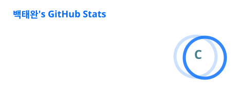
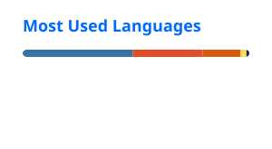

## Tech Stack

  
  
  
  

  

## GitHub Stats

  
  

  

## DAILY-STUDY

> 매일 **AI·DA**와 **Backend** 분야에서 핵심 개념을 하나씩 학습합니다.

<!-- DAILY_STUDY:START -->
### Study Dashboard

| 🔥 현재 스트릭 | 🏆 최장 스트릭 | 📅 완료한 학습일 | 🧠 완료한 질문 | 🔁 복습 |
|---:|---:|---:|---:|---:|
| **2일** | **6일** | **39일** | **66개** | **0회** |

#### 최근 학습

| 날짜 | AI·DA | Backend |
|---|---|---|
| 2026-09-29 | [GQA(Grouped-Query Attention)와 MHA·MQA](https://github.com/sebalnakji/DAILY-STUDY/blob/main/notes/2026/2026-09-29-ai-data-gqa-vs-mha.md) | - |
| 2026-09-28 | [모수적 vs 비모수적 알고리즘(Parametric vs Non-parametric)](https://github.com/sebalnakji/DAILY-STUDY/blob/main/notes/2026/2026-09-28-ai-data-parametric-vs-nonparametric.md) | - |
| 2026-09-22 | [Adam과 SGD — 적응적 옵티마이저와 학습률 스케줄](https://github.com/sebalnakji/DAILY-STUDY/blob/main/notes/2026/2026-09-22-ai-data-adam-vs-sgd.md) | - |
| 2026-09-21 | [Flash Attention — I/O 인식 어텐션](https://github.com/sebalnakji/DAILY-STUDY/blob/main/notes/2026/2026-09-21-ai-data-flash-attention.md) | - |
| 2026-09-17 | [전이학습(Transfer Learning)](https://github.com/sebalnakji/DAILY-STUDY/blob/main/notes/2026/2026-09-17-ai-data-transfer-learning.md) | - |
<!-- DAILY_STUDY:END -->
